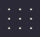
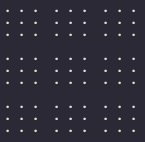
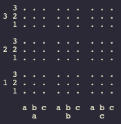
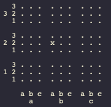
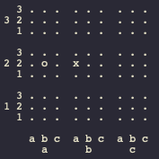
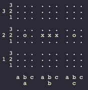
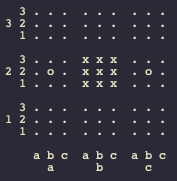
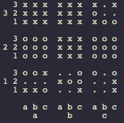
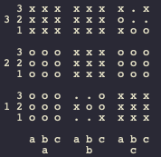

# ut3 (ultimate tic tac toe)

_made by catroidvania_

## dependancies

| name | link |
|---------|------|
| Sqlite3 | <https://www.sqlite.org/index.html> |
| MinGW (if on windows) | <https://www.mingw-w64.org> |
| GNU make (if not on windows) | <https://www.gnu.org/software/make/> |
| a valid c compiler (this project uses GNU gcc) | <https://gcc.gnu.org> |

sqlite3 is included with the project since its public domain code so

hip hip hurrah for that! if not then you will need to put the files:

- sqlite3.c
- sqlite3.h

into the `/deps/` folder.

if you are on windows you will need a version of mingw to build the project

the link is included in the table above in the MinGW section just 

navigate to the downloads section and install the version for you system

you can check that it is installed correctly by running the command:

```
gcc --version
```

as long as the command is recognised it should work

this also means that `gcc` is included with MinGW

this command also works for verifying that `gcc` is installed correctly

## building

### windows

make sure you have either `minGW32` or `minGW-w64` (for 32bit and 64bit

computers respectively) installed. then change directories into `/ut3/` 

and run:

```
mingw32-make
```

if all works right then the executable will be in the `/build/` directory

and you can run it with:

```
ut3
```

### linux / macos

building on unix requires gnu `make` utility as well as `gcc` or another

valid c compiler (you will need to change the `CC` variable in the Makefile

if youre using another compiler). change into the `/ut3/` directory and run:

```
make
```

and then you should find the `ut3` executable in the `/build/` directory.

run it with:

```
./ut3
```

## documentation

it is in the works at the moment but documentation for the code is done as

in file comments

this is neither a particularly complicated program nor one that i expect needs

over detailed documentation but i am availible to clarify certain parts of my

spaghetti code if you need it

## license

find out more about the MIT license here <https://snyk.io/learn/what-is-mit-license/>

## how to play

note that the game can be played with a pencil and paper so you dont actually

need this program to play the game

### understanding the coordinate system

if you know how to play tic tac toe you can play ultimate tic tac toe!

as opposed to the three by three tic tac toe board:





the ultimate tic tac toe board is nine by nine!

but dont let that scare you its really just a three by three grid of 

regular tic tac toe boards:





this program uses what i call major-minor notation for its coordinates

with the major part refering to the position of the regular tic tac toe

board on the larger board and the minor part refering to the position of the

tile inside the regular board so the coords system looks something like this:





as an example playing to the bottom left in the centre board would be:

```
b2a1
```

since its in the major `b2` (centre board) and on the minor `a1` (bottom left)

now that we have notation done onto the game itself!

### playing the game

the first player starts by playing anywhere on the board





here they are represented as `x` and play the move b2a2 (centre middle left)

now the next player is not so lucky

they are `sent' (forced to play in) the major corresponding to the minor

coordinate of the last move

so the second player has to play in the major a2





thus a2b2 is played and so on and on

but the game doesnt go on forever like this

you win by first winning the smaller tic tac toe games and each small win

can be seen as one move one on the larger board which you must score on to

win the whole game itself

for the sake of explanation lets assume the game has played out to this point





now that the centre has been won by `x` it is no longer able to be played in

this program represents it like below but you can just draw a big `x` or `o`

over the whole thing on pencil and paper edition





now that `x` has scored this means that the next move can be made anywhere

that isnt already filled

(note that this is a house rule and in most versions you still need to follow

the send restrictions after a score)

everntually the board starts to fill up and you may find yourself sending or

sent to an already won major





lets say `o` plays b1b2 (middle bottom centre) which has already been won and

so cannot be played in

in this case the next move can be played in anywhere that isnt already filled

this continues until one of the players wins enough majors that form a winning

position in a regular tic tac toe game





now `x` has won in a diagonal line which in normal tic tac toe is a winning

position so `x` wins the game

this can happen for any valid tic tac toe position and the game can also tie

if all valid moves are exhausted and there is no winner

there can also be ties for each of the smaller boards themselves which means

nobody gets that major

### other stuff to note i guess

scoring on a major does not need to be done in alternating turns like in

tic tac toe so `x` could score the majors a1 then c1 then c2 without `o`

ever winning anything or vice versa

if you have trouble reading my instructions the wikipedia article may be of

use: <https://en.wikipedia.org/wiki/Ultimate_tic-tac-toe>

## finally

have fun ultimate tic tac toer!

catroidvania out!

